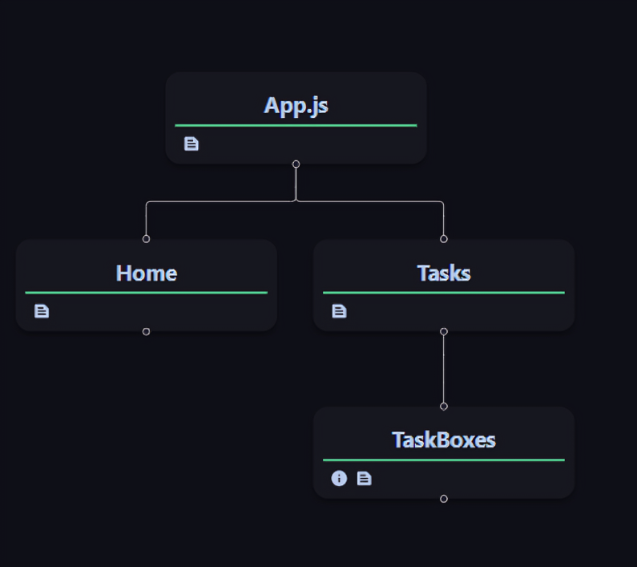

# Taskify - Task Tracker Application Documentation

## Introduction

Taskify is a web-based application designed for efficient task Tracking. It allows users to create, organize, and track tasks seamlessly. The application is built using React.js and leverages various packages for enhanced functionality and user experience.

## Features

### Task Management:
- Create tasks with titles, descriptions, teams, assignees, start dates, end dates, priorities, and statuses.
- View tasks based on different statuses such as Pending, In Progress, Completed, Deployed, and Deferred.
- Filter and sort tasks based on assignee, priority, start date, and end date.

### Task Manipulation:
- Add new tasks with customizable details.
- Edit existing tasks to update priorities and statuses.
- Delete tasks that are no longer needed.

### User Interface:
- Intuitive and user-friendly interface for easy navigation and task management.
- Responsive design for seamless user experience across devices.

## Components

1. **Home Component**
   - Description: Renders the homepage of the Taskify application.
   - Functionality: Displays an introduction to Taskify with a call-to-action to get started.

2. **Tasks Component**
   - Description: Manages the tasks functionality including task creation, editing, deletion, filtering, sorting and Navigation for different statuses.
   - Functionality: Provides a comprehensive interface for users to manage their tasks efficiently.

3. **TaskBoxes Component**
   - Description: Renders individual task boxes with details such as title, description, assignee, priority, status, and options for editing and deleting tasks.
   - Functionality: Facilitates visualization and interaction with individual tasks within the application.

## Packages Used

- **react-router-dom**: For managing routing within the application.

## Usage

To use the Taskify application, follow these steps:

1. Navigate to the homepage of the application.
2. Click on "Get Started" to proceed to the tasks dashboard.
3. Add new tasks by clicking on the "Add Task" button and filling in the required details.
4. Edit existing tasks by clicking on the task box and modifying the necessary fields.
5. Delete tasks by clicking on the delete option within the task box.
6. Filter tasks based on assignee, priority, start date, and end date using the filter options.
7. Sort tasks based on priority, start date, or end date using the sort options.

## Component Structure

## Conclusion

Taskify offers a robust solution for task management, providing users with a streamlined interface and powerful features for organizing and tracking tasks effectively. With its intuitive design and comprehensive functionality, Taskify simplifies the task management process and enhances productivity.
